# Prometheus+Grafana实现SpringBoot应用监控

# 一  集成prometheus

### 1.prometheus 安装

> prometheus是Golang开发的一套基于时序数据库的指标采集程序，用户可以非常方便的安装和使用Prometheus并且能够非常方便的对其进行扩展。

官网下载地址： https://prometheus.io/download/

* Linux下本地安装启动

  ```bash
  wget https://github.com/prometheus/prometheus/releases/download/v2.33.3/prometheus-2.33.3.linux-amd64.tar.gz
  
  tar -zxvf prometheus-2.33.3.linux-amd64.tar.gz
  cd prometheus-2.33.3.linux-amd64
  
  # 启动命令
  ./prometheus &
  ...
  ts=2022-02-22T03:03:43.645Z caller=web.go:570 level=info component=web msg="Start listening for connections" address=0.0.0.0:9090
  ...
  ```

* 查看指标

  启动完毕之后，本地访问 http://127.0.0.1:9090/graph 可以看到默认提供的界面

### 2.接入SpringBoot应用

> 使用SpringBoot为2.0+，需要选择`io.micrometer` 的依赖包来实现；更低1.0+版本可以直接使用官方提供的client来实现

* 2.1环境配置

  使用SpringBoot的actuator来提供扩展端点，Prometheus通过actuator暴露的接口拉取指标数据

  ```xml
  <?xml version="1.0" encoding="UTF-8"?>
  <project xmlns="http://maven.apache.org/POM/4.0.0" xmlns:xsi="http://www.w3.org/2001/XMLSchema-instance"
  	xsi:schemaLocation="http://maven.apache.org/POM/4.0.0 https://maven.apache.org/xsd/maven-4.0.0.xsd">
  	<modelVersion>4.0.0</modelVersion>
  	<parent>
  		<groupId>org.springframework.boot</groupId>
  		<artifactId>spring-boot-starter-parent</artifactId>
  		<version>2.6.3</version>
  		<relativePath/> <!-- lookup parent from repository -->
  	</parent>
  	<groupId>com.gxf.app.monitor</groupId>
  	<artifactId>springboot-prometheus</artifactId>
  	<version>0.0.1-SNAPSHOT</version>
  	<name>springboot-prometheus</name>
  	<description>springboot-prometheus</description>
  	<properties>
  		<java.version>1.8</java.version>
  	</properties>
  	<dependencies>
  		<dependency>
  			<groupId>org.springframework.boot</groupId>
  			<artifactId>spring-boot-starter-actuator</artifactId>
  		</dependency>
  		<dependency>
  			<groupId>org.springframework.boot</groupId>
  			<artifactId>spring-boot-starter-web</artifactId>
  		</dependency>
  		<dependency>
  			<groupId>io.micrometer</groupId>
  			<artifactId>micrometer-registry-prometheus</artifactId>
  		</dependency>
  		<dependency>
  			<groupId>org.springframework.boot</groupId>
  			<artifactId>spring-boot-devtools</artifactId>
  			<scope>runtime</scope>
  			<optional>true</optional>
  		</dependency>
  		<dependency>
  			<groupId>org.projectlombok</groupId>
  			<artifactId>lombok</artifactId>
  			<optional>true</optional>
  		</dependency>
  		<dependency>
  			<groupId>org.springframework.boot</groupId>
  			<artifactId>spring-boot-starter-test</artifactId>
  			<scope>test</scope>
  		</dependency>
  	</dependencies>
  
  	<build>
  		<plugins>
  			<plugin>
  				<groupId>org.springframework.boot</groupId>
  				<artifactId>spring-boot-maven-plugin</artifactId>
  				<configuration>
  					<excludes>
  						<exclude>
  							<groupId>org.projectlombok</groupId>
  							<artifactId>lombok</artifactId>
  						</exclude>
  					</excludes>
  				</configuration>
  			</plugin>
  		</plugins>
  	</build>
  
  </project>
  
  ```

* 2.2 启动应用

  配置应用

  ```java
  package com.gxf.app.monitor;
  
  import io.micrometer.core.instrument.MeterRegistry;
  import org.springframework.beans.factory.annotation.Value;
  import org.springframework.boot.SpringApplication;
  import org.springframework.boot.actuate.autoconfigure.metrics.MeterRegistryCustomizer;
  import org.springframework.boot.autoconfigure.SpringBootApplication;
  import org.springframework.context.annotation.Bean;
  
  @SpringBootApplication
  public class SpringbootPrometheusApplication {
  
  	public static void main(String[] args) {
  		SpringApplication.run(SpringbootPrometheusApplication.class, args);
  	}
  
  	// 注册应用
  	@Bean
  	MeterRegistryCustomizer<MeterRegistry> configurer(@Value("${spring.application.name}") String applicationName) {
  		return (registry) -> registry.config().commonTags("application", applicationName);
  	}
  }
  ```

  简单请求测试

  ```java
  package com.gxf.app.monitor.ctrl;
  
  import org.springframework.web.bind.annotation.GetMapping;
  import org.springframework.web.bind.annotation.RestController;
  
  import java.util.Random;
  
  @RestController
  public class DemoCtrl {
      private Random random = new Random();
  
      // 一个用于演示的http接口
      @GetMapping(path = "random")
      public String random(String name) {
          int sleep = random.nextInt(200);
          try {
              Thread.sleep(sleep);
          } catch (InterruptedException e) {
              e.printStackTrace();
          }
          return String.format("sleep:%s millis,for %s", sleep ,name);
      }
  }
  ```

### 3.prometheus 配置

修改prometheus.yml,新增应用actuator地址

```yaml
# my global config
global:
  scrape_interval: 15s # Set the scrape interval to every 15 seconds. Default is every 1 minute.
  evaluation_interval: 15s # Evaluate rules every 15 seconds. The default is every 1 minute.
  # scrape_timeout is set to the global default (10s).

# Alertmanager configuration
alerting:
  alertmanagers:
    - static_configs:
        - targets:
          # - alertmanager:9093

# Load rules once and periodically evaluate them according to the global 'evaluation_interval'.
rule_files:
  # - "first_rules.yml"
  # - "second_rules.yml"

# A scrape configuration containing exactly one endpoint to scrape:
# Here it's Prometheus itself.
scrape_configs:
  # The job name is added as a label `job=<job_name>` to any timeseries scraped from this config.
  - job_name: "prometheus"

    # metrics_path defaults to '/metrics'
    # scheme defaults to 'http'.

    static_configs:
      - targets: ["localhost:9090"]
  - job_name: 'prometheus-example'
    scrape_interval: 1s
    metrics_path: '/actuator/prometheus'
    static_configs:
      - targets: ['127.0.0.1:8080']

```

重启服务，访问：http://localhost:9090/graph

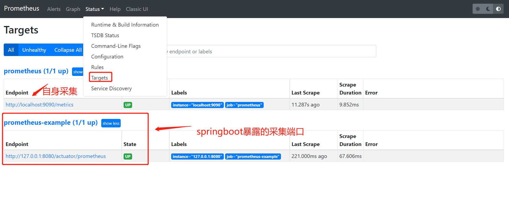

访问Graph，选择metric: `http_server_requests_seconds_count` 可以看到一条采集metric的记录

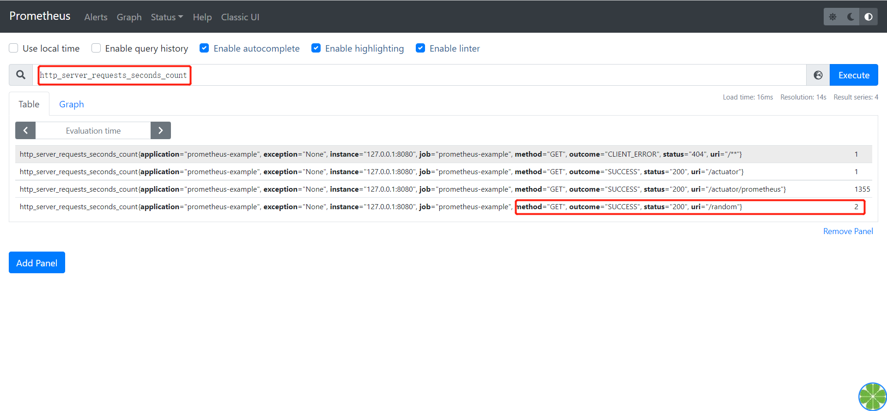

接下来多次访问应用接口：http://localhost:8080/random?name=test，再次查看指标会发现/random访问次数增加了

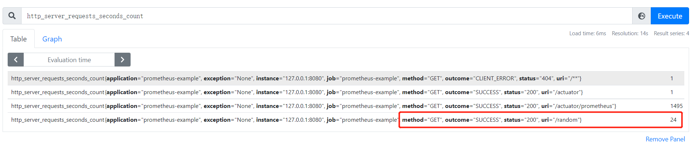

这些数据由框架层直接集成，实现REST接口的相关信息上报，借助这些metric，我们可以实现接口qps和耗时的统计

### 4.接口统计

* 4.1 qps统计

  借助prometheus提供查询语言可以对指标进行复杂运算。计算QPS：

  ```
  sum(rate(http_server_requests_seconds_count{application="prometheus-example"}[10s]))
  ```

  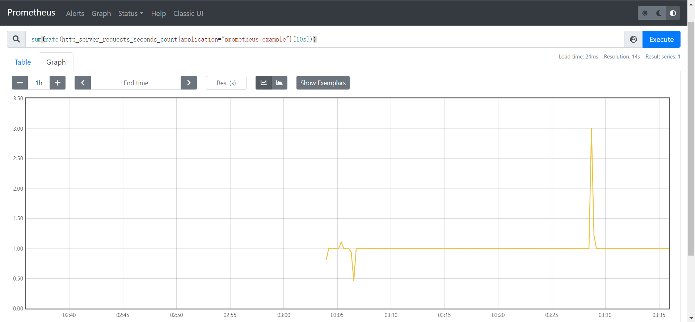

  * rate: 用于统计增长趋势，要求上报的Metric为Counter类型（只增不减）

  - irate: 与rate相似，区别在于rate统计的是一段时间内的平均增长速率，无法反应这个时间窗口内的突发情况（即瞬时高峰），irate通过区间向量中最后两个样本数据来计算增长速率，但是当选用的区间范围较大时，可能造成不小的偏差
  - sum: 求和，适用于统计场景

  更多内置函数，可以参考: [PromQL内置函数](https://www.prometheus.wang/promql/prometheus-promql-functions.html)

​       把sum函数移除则可以看到每个接口统计：

```
rate(http_server_requests_seconds_count{application="prometheus-example"}[10s])
```

​       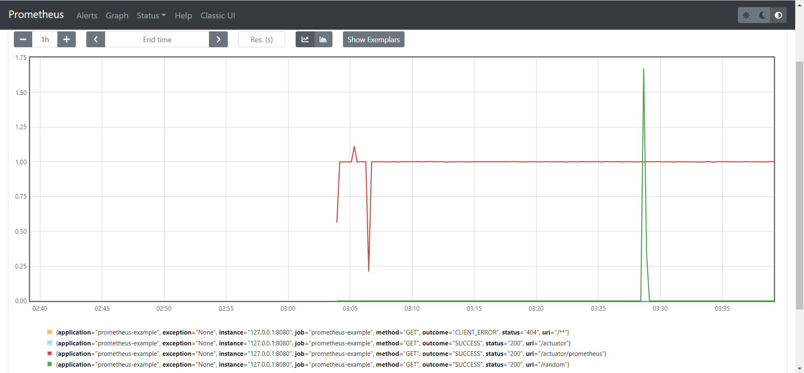

* 4.2 接口耗时统计

  ```
  rate(http_server_requests_seconds_sum{application="prometheus-example"}[10s]) / rate(http_server_requests_seconds_count{application="prometheus-example"}[10s])
  ```

​       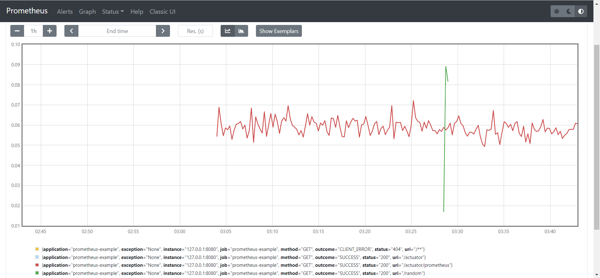

### 5.Grafana 大盘配置

> Grafana是Golang开发的指标可视化展示程序，可以做位prometheus的指标可视化平台。他不仅支持prometheus，还支持其他各种类型的数据源。

* 5.1 安装

  下载地址：https://grafana.com/grafana/download?pg=get&platform=linux&plcmt=selfmanaged-box1-cta1

* 5.2 启动

  ```
  sudo /etc/init.d/grafana-server start
  ```

  测试: [http://localhost:3000](http://localhost:3000/)

  登录密码: admin/admin

* 5.3 配置数据源

  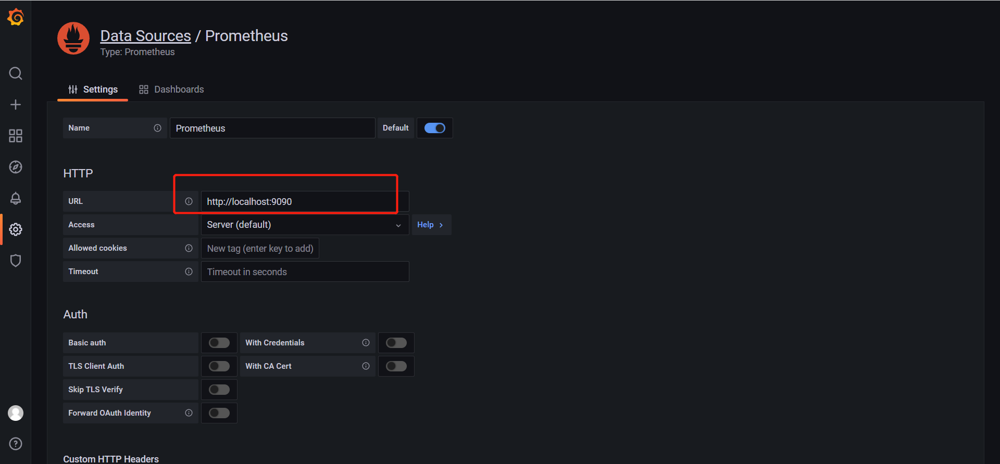

* 5.4导入JVM大盘

  访问：https://grafana.com/grafana/dashboards/?search=jvm

  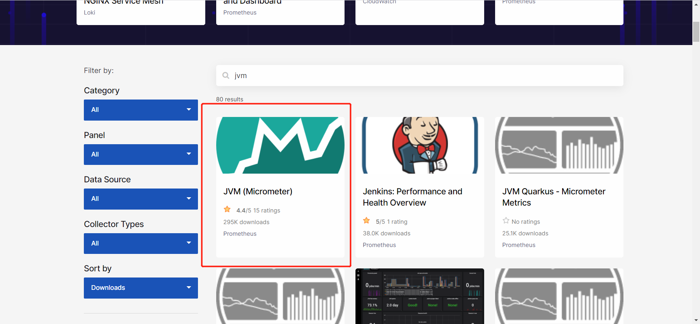

  点击看到打开的地址是：https://grafana.com/grafana/dashboards/4701，这里4701就是大盘ID

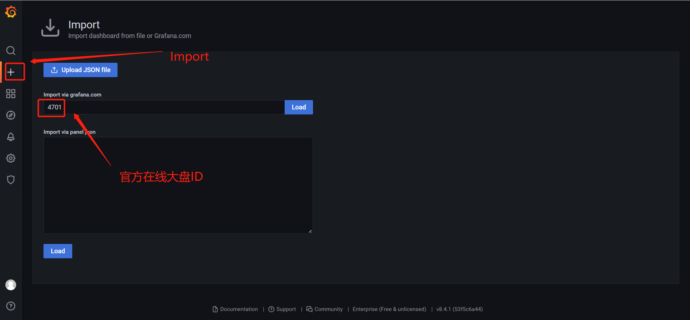

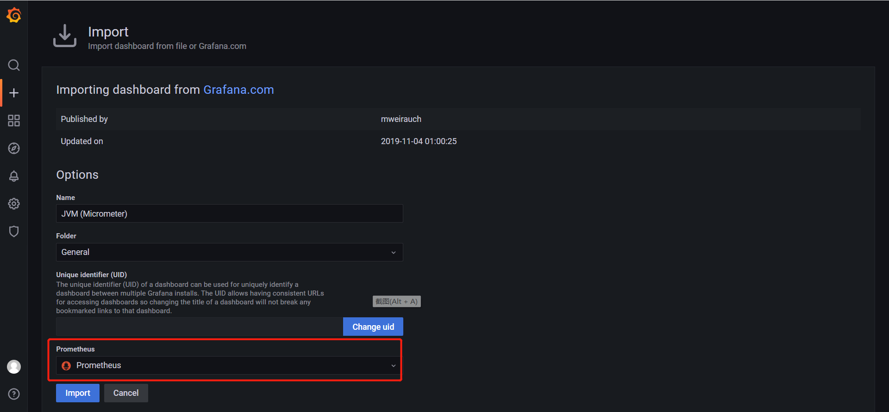

导入后可以查看JVM相关指标

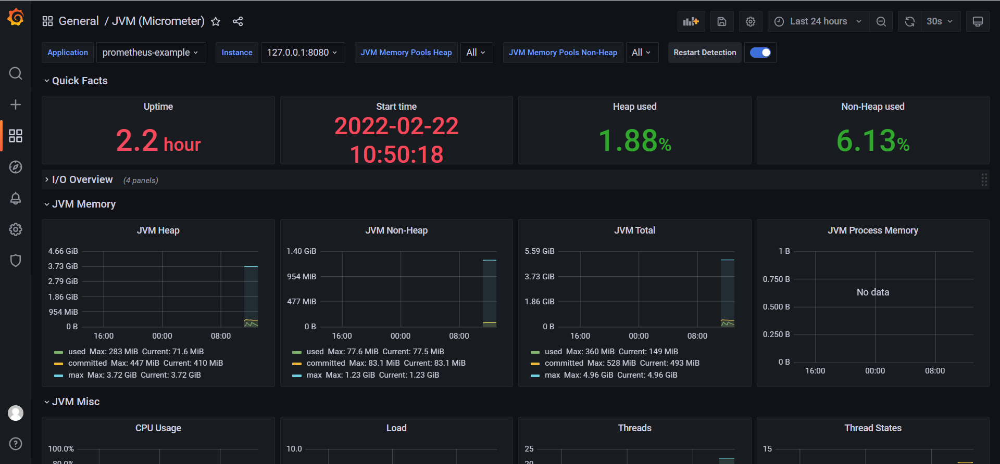

* 5.5 新建自定义大盘

新建dashborad,然后填写查询语句：

```
rate(http_server_requests_seconds_count{application="prometheus-example"}[10s])
```

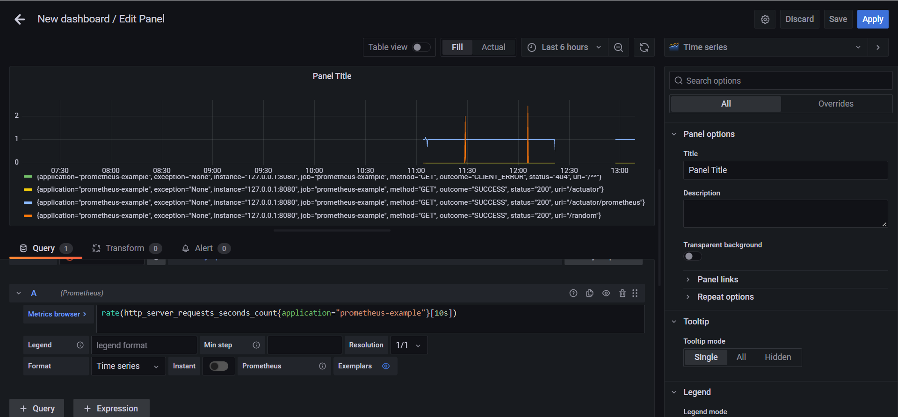

# 二  自定义指标开发

> 继上文集成了micrometer库自带的监控指标。在我们的实际业务开发往往需要自定义埋点上报，下面介绍具体的开发流程。

假设我们现在想自己上报http请求的相关信息，当前计划采集下面几个信息（来自prometheus.client包）

- 总的请求数：采用`Counter`
- 当前正在处理的请求数：采用`Gauge`
- 请求耗时直方图: `Histogram`

### 1. 基于`simpleclient`实现自定义指标

```java
package com.gxf.app.monitor.metric;

import io.prometheus.client.CollectorRegistry;
import io.prometheus.client.Counter;
import io.prometheus.client.Gauge;
import io.prometheus.client.Histogram;
import org.springframework.beans.BeansException;
import org.springframework.context.ApplicationContext;
import org.springframework.context.ApplicationContextAware;
import org.springframework.stereotype.Component;

/**
 * @author xufangong
 * @date 2022/02/22
 */
@Component
public class PrometheusComponent implements ApplicationContextAware {
    private static PrometheusComponent instance;


    /**
     * 请求总数
     */
    private Counter reqCounter;

    /**
     * 正在请求的http数量
     */
    private Gauge duringReqGauge;

    /**
     * 直方图，请求分布情况
     */
    private Histogram reqLatencyHistogram;

    @Override
    public void setApplicationContext(ApplicationContext applicationContext) throws BeansException {
        instance = this;
        // 获取SpringBoot容器的CollectorRegistry
        CollectorRegistry collectorRegistry = applicationContext.getBean(CollectorRegistry.class);
        // 定义三个采集指标和标签
        reqCounter = Counter.build().name("example_rest_req_total").labelNames("path", "method", "code")
                .help("总的请求计数").register(collectorRegistry);
        duringReqGauge = Gauge.build()
                .name("example_rest_inprogress_req").labelNames("path", "method")
                .help("正在处理的请求数").register(collectorRegistry);
        reqLatencyHistogram = Histogram.build().labelNames("path", "method", "code")
                .name("example_rest_requests_latency_seconds_histogram").help("请求耗时分布")
                .register(collectorRegistry);
    }

    public static PrometheusComponent getInstance() {
        return instance;
    }

    public Counter counter() {
        return reqCounter;
    }

    public Gauge gauge() {
        return duringReqGauge;
    }

    public Histogram histogram() {
        return reqLatencyHistogram;
    }
}
```

注意上面的`setApplicationContext()`的方法实现逻辑，其中在创建`Counter/Gauge/Histogram`时，使用的是`simpleclient`包中提供的最基础的用法，并不是`micrometer`的封装方式，后面继续介绍这两种方式的差异性。

上面实现的特点在于，创建Metric时，就已经定义好了label标签，这里定义了

- path: 请求uri路径
- method: http方法, get/post
- code: 状态码，表示请求成功还是失败

### 1.2 拦截器

```java
package com.gxf.app.monitor.metric;

import io.prometheus.client.Histogram;
import org.springframework.web.servlet.AsyncHandlerInterceptor;

import javax.servlet.http.HttpServletRequest;
import javax.servlet.http.HttpServletResponse;

public class PrometheusInterceptor implements AsyncHandlerInterceptor {
    private ThreadLocal<Histogram.Timer> timerThreadLocal = new ThreadLocal<>();

    @Override
    public boolean preHandle(HttpServletRequest request, HttpServletResponse response, Object handler) throws Exception {
        // 正在处理的请求量
        PrometheusComponent.getInstance().gauge().labels(request.getRequestURI(), request.getMethod()).inc();
        // 请求耗时计时器
        timerThreadLocal.set(PrometheusComponent.getInstance().histogram()
                .labels(request.getRequestURI(), request.getMethod(), String.valueOf(response.getStatus()))
                .startTimer());
        return true;
    }

    @Override
    public void afterCompletion(HttpServletRequest request, HttpServletResponse response, Object handler, Exception ex) throws Exception {
        String uri = request.getRequestURI();
        String method = request.getMethod();
        int status = response.getStatus();
        // count请求计数+1，标签分别为 请求路径，请求方法，response http code
        PrometheusComponent.getInstance().counter().labels(uri, method, String.valueOf(status)).inc();

        // 请求完毕，正在请求计数器-1
        PrometheusComponent.getInstance().gauge().labels(uri, method).dec();

        // 请求耗时采集结束
        Histogram.Timer timer = timerThreadLocal.get();
        if (timer != null) {
            timer.observeDuration();
            timerThreadLocal.remove();
        }
    }
}
```

- 执行之前（`preHandle`）： gauge计数+1，开始计时
- 执行之后 (`afterCompletion`)： guage计数-1，counter计数+1，计时收集结束

### 1.3测试

刷新http://localhost:8080/random?name=test，然后查看:http://localhost:9090/graph

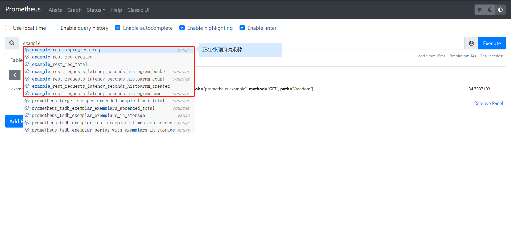

现在可以看到我们自定义的指标了

### 2 基于micrometer实现自定义指标

> 上边采用的`simpleclient`包定义的几个metric来实现的。实际上有更简单方便的姿势，那就是直接借助micrometer的`MeterRegistry`来创建Metric来实现数据采集即可

```java
package com.gxf.app.monitor.metric;

import io.micrometer.core.instrument.MeterRegistry;
import io.micrometer.core.instrument.Tags;
import io.micrometer.core.instrument.Timer;
import org.springframework.beans.factory.annotation.Autowired;
import org.springframework.web.servlet.AsyncHandlerInterceptor;
import org.springframework.web.servlet.ModelAndView;

import javax.servlet.http.HttpServletRequest;
import javax.servlet.http.HttpServletResponse;
import java.time.Duration;

public class MetricInterceptor implements AsyncHandlerInterceptor {
    @Autowired
    private MeterRegistry meterRegistry;
    private ThreadLocal<Timer.Sample> threadLocal = new ThreadLocal<>();

    @Override
    public boolean preHandle(HttpServletRequest request, HttpServletResponse response, Object handler) throws Exception {
        // 总计数 + 1
        meterRegistry.counter("micro_req_total", Tags.of("url", request.getRequestURI(), "method", request.getMethod())).increment();
        // 处理中计数 +1
        meterRegistry.gauge("micro_process_req", Tags.of("url", request.getRequestURI(), "method", request.getMethod()), 1);

        Timer.Sample sample = Timer.start();
        threadLocal.set(sample);
        return true;
    }

    @Override
    public void postHandle(HttpServletRequest request, HttpServletResponse response, Object handler, ModelAndView modelAndView) throws Exception {
        meterRegistry.gauge("micro_process_req", Tags.of("url", request.getRequestURI(), "method", request.getMethod()), -1);
        //  Timer timer = meterRegistry.timer("micro_req_histogram", Tags.of("url", request.getRequestURI(), "method", request.getMethod(), "code", String.valueOf(response.getStatus())));
        Timer timer = Timer.builder("micro_req_histogram").minimumExpectedValue(Duration.ofMillis(1)).maximumExpectedValue(Duration.ofMinutes(3))
                .sla(Duration.ofMillis(10), Duration.ofMillis(50), Duration.ofMillis(100), Duration.ofMillis(300), Duration.ofMillis(1000))
                .tags(Tags.of("url", request.getRequestURI(), "method", request.getMethod(), "code", String.valueOf(response.getStatus())))
                .register(meterRegistry);
        threadLocal.get().stop(timer);
        threadLocal.remove();
    }
}
```

添加拦截器即可

```java
package com.gxf.app.monitor.metric;

import org.springframework.context.annotation.Bean;
import org.springframework.context.annotation.Configuration;
import org.springframework.web.servlet.config.annotation.InterceptorRegistry;
import org.springframework.web.servlet.config.annotation.WebMvcConfigurer;

//注册拦截器
@Configuration
public class WebAppConfig implements WebMvcConfigurer
{

    @Bean
    public MetricInterceptor metricInterceptor() {
        return new MetricInterceptor();
    }
    @Bean
    public PrometheusInterceptor prometheusInterceptor() {
        return new PrometheusInterceptor();
    }

    @Override
    public void addInterceptors(InterceptorRegistry registry)
    {
        //注册自己的拦截器并设置拦截的请求路径
        registry.addInterceptor(prometheusInterceptor()).addPathPatterns("/**");
        registry.addInterceptor(metricInterceptor()).addPathPatterns("/**");

    }
}
```

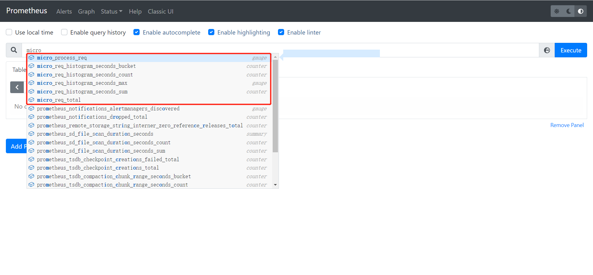
